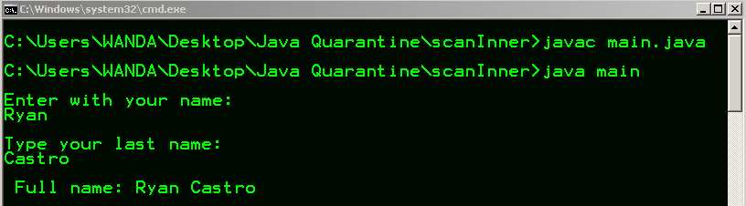
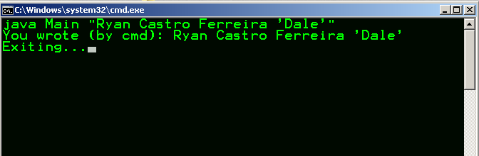
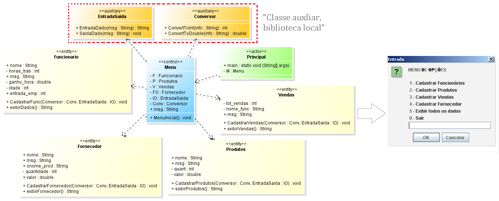
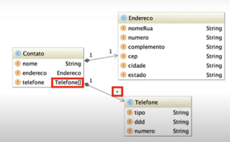
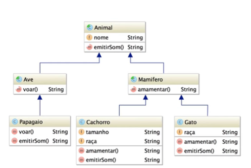
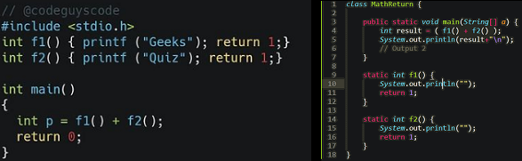

<h1>JAVA</h1>

Justify, with progress programming in the language.

 
<h2>Abount this...</h2>

This Repository focused on the realization of Cases, challenges and applications for specific. To learn (designer) patterns on github. 
The theme is dev-java with different projects in the same repo. However, detailed the processes of each application.

 
<h2>Why?</h2>

Made to solve (training) programming logic issues. 
Particularity, Develop fragmented problems in individual files in the same Repository.

By RYAN CASTRO FERREIRA, 
<b style="color: blue;">LinkdIn </b>- https://www.linkedin.com/in/ryan-castro-ferreira/  
<b style="color: red;">Email </b>- ryancasf@gmail.com  

 
<h2>Built details develop on CMD | Prompt</h2>

Specif things to make it

 
<h2>Built jPanel</h2>

Transformation in UML to Work (BD local var)

 
<h2>Built Auxiliary class</h2>

Desenvolviment with a local own bibliotec, class Convert, Input and Output 
Without any import local because of the class use

 
<h2>Diagrams and Projects made</h2>

Inheritance, to inherit attributes and methods from one class to another.  
	<ul>
		<li><b>Subclass (child) </b> - The class that inherits from another class;</li>
		<li><b>Superclass (mom / dad) </b> - The class being inherited from.</li>
	</ul>

  

When there is an inheritance of objects, to call the superclass.
  

Static method with math return args. Belongs to the class, rather than an object.
  